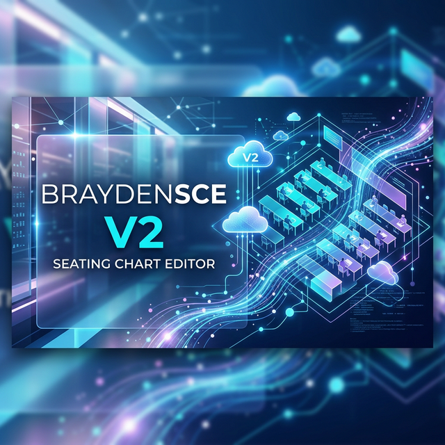

# BraydenSCE V2 (座位表编辑器)

一个跨平台、现代化的智能排班与座位表可视化编辑器。支持在浏览器直接使用，也可以下载 Windows 纯净桌面版（轻量级 Tauri版 和 独立 Electron版）。

当前在线体验版： <https://sce.rth1.xyz/>

发布者：Braydenccc or Jbyccc

## 🌟 核心功能特性

- **可视化座位表编辑**：支持按不同行列组创建自适应布局的排位地图。
- **智能化人际关系网**：支持为学生添加特殊的“吸引”或“排斥”关系，生成座位时可根据关系亲疏进行自动化智能排位（自动避开仇恨、聚拢友好）。
- **快捷标签管理**：内置彩色标签系统，并通过选区功能（拖拽圈选特定座位区）限定拥有指定标签的学生只能排入划定的区域内（例如：走读生区域、特殊视力照顾区域）。
- **极速名单录入**：支持一键从内置 Excel 模板导入成百上千的学生数据及批量打标签。一键支持全量导出。
- **美观长图一键存**：无需网页截图插件，内置原生画布引擎，将做好的精美排位图直接按海报级高清导出 `.png`。
- **跨端云同步工作区**：免费内置跨设备云端储存支持！注册账号即可安全地将不同的班级配置信息全部备份至云端。

## 📖 使用指南

### 1. 基础配置
1. **录入学生**：在左侧滑出的控制面板中，点击顶部的数据标签页，直接通过“导入/导出”按钮下载 Excel 模板。填入班级学生学号、姓名以及相关标签后，一键导入网页。
2. **设定标签与分区**：您可以对特殊学生（如：需要前排）添加特定的身份标签。然后在“分区与限制”面板点击“画笔”，圈住讲台前的数个好座位，并在侧边栏限制这些座位[仅允许包含'前排'标签的学生坐入]。
3. **设置长宽与组距**：点击“配置”面板，调节整个教室的行列，以及走廊的空白间隙。

### 2. 智能化座位分配
1. 切换到“人物关系”面板。
2. 为需要隔离的学生添加 [排斥] 关系。为需要坐在一起互助的学生添加 [吸引] 关系。
3. 点击“一键分配”，算法将随机打乱所有成员并尝试输出一套符合你在“分区限制”与“人际关系限制”下的完美解。

### 3. 微调与修饰
你随时可以开启顶部栏的：
- **交换模式**：用来快速互换系统生成的两个人的位置。
- **清空模式**：用来挖空某些不坐人的走廊/过道座位。

完成后，点击“一键导出照片”即可获得你的排班大作！

## 🚀 私有化部署说明

本项目通过 **Vite + Vue3** 开发。并原生支持将后端服务挂载至 **热铁盒 (Retinbox)** 面板服务器上！

### 开发环境调试
```bash
npm install
npm run dev
```

### 生产环境与云端部署
项目集成了热铁盒自带的云函数特性，所有的用户登录与工作区云存档功能，均依赖 `public/api/*.php` 无服务器函数执行。

你可以一键使用以下命令完成构建和针对热铁盒的云部署：
```bash
npm run deploy
```
*(注意：你需要配置好热铁盒的 `RTH_API_KEY` 环境变量)*

### 本机客户端编译
若你需要分发无需联网的离线桌面使用版，可直接使用内置指令执行跨端打包：

- **编译轻量版安装包 (<5MB, 需 Win10+ 自带 WebView)**
  ```bash
  npm run build:lite
  ```
- **编译完整离线包 (~110MB, 内置 Chromium 独立引擎)**
  ```bash
  npm run build:full
  ```

## 💖 赞助与支持

觉得好用的话，可以请作者喝杯奶茶：
[赞助通道](https://afdian.com/a/brayden)
